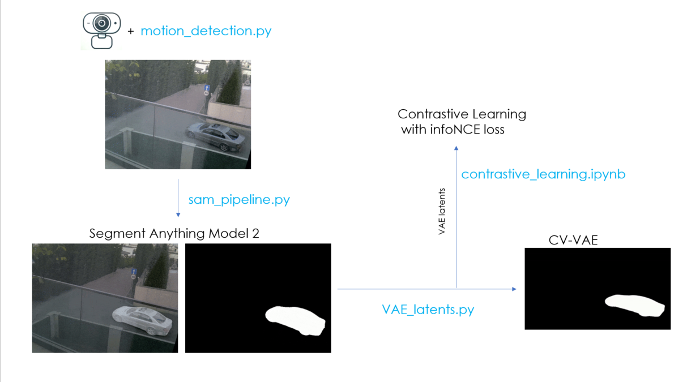
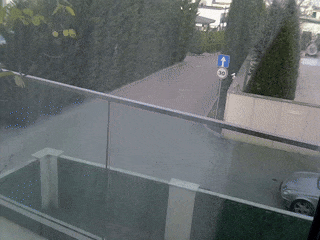
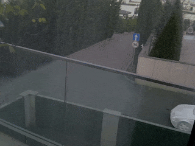
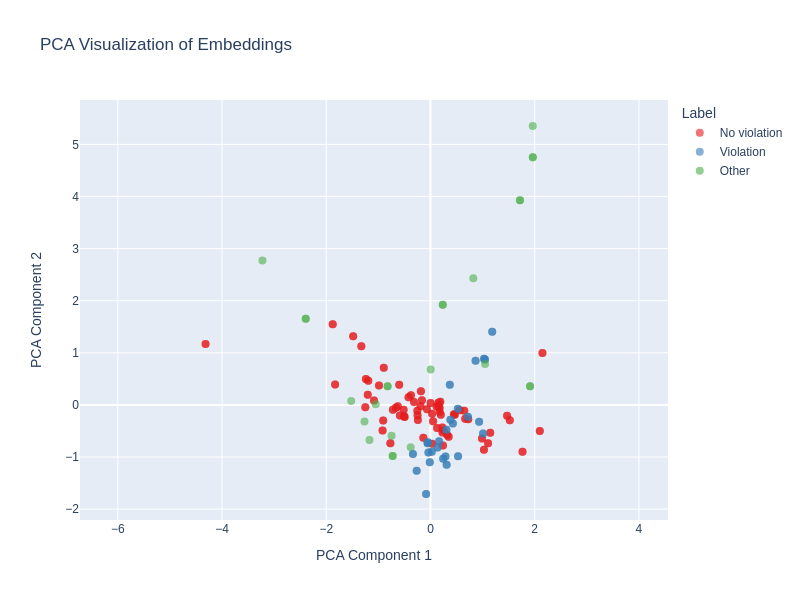

# 🚗 One-Way Violation Detector

### 📌 Overview
This project utilizes Segment Anything Model (SAM) and CV-VAE (Compatible Video VAE for Latent Generative Video Models) to detect vehicles violating a one-way traffic rule. By leveraging self-supervised contrastive learning (InfoNCE Loss), the model learns to classify latent embeddings of video clips into compliant and non-compliant traffic behavior.

### 🛠️ Methodology
**Data Collection:**
- Recorded ~500 video clips using a webcam positioned near a one-way road.

**Manual Annotation:**
- Labeled clips where vehicles were violating the one-way sign.

**Object Segmentation:**
- Used SAM (Segment Anything Model) to extract vehicle movements from clips, removing background noise.
 

**Latent Representation Extraction:**
- Encoded clips into latent embeddings using CV-VAE (Video Variational Autoencoder).

**Contrastive Learning for Classification:**
- Trained a classifier using InfoNCE loss to differentiate compliant vs. violating traffic behavior.

**Evaluation:**
- Achieved 100% accuracy in detecting violations on the test dataset.

### 🚀 Results & Applications
Successfully detects vehicles violating one-way traffic rules with high accuracy.
Can be extended to other traffic rule violations with minimal modifications.
Potential for real-time deployment with optimized inference pipelines.

### 📌 Future Work
The next goal is to extract the motion latent vector during the inference stage.
https://github.com/pzlav/vae_motion_embedding

### ⚡ Tech Stack
Segment Anything Model (SAM) https://github.com/facebookresearch/sam2
CV-VAE https://ailab-cvc.github.io/cvvae/index.html
InfoNCE Loss for self-supervised learning

